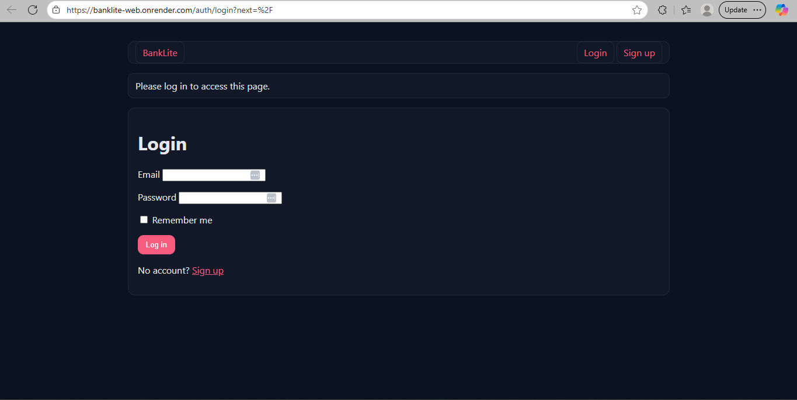

# BankLite — Flask Banking App 🏦🌙💖  
Minimal banking demo with **Flask + SQLAlchemy**, authentication, HTML views, and a JSON API.


👉 [**Live Demo (Render)**](https://banklite-web.onrender.com/auth/login?next=%2F) 



---

## ✨ Overview
BankLite is a teaching/demo banking backend.  
Users can sign up, create **Checking/Savings accounts**, and perform **deposits, withdrawals, and transfers**.  

It demonstrates:
- Flask app factory + blueprints  
- SQLAlchemy models & migrations  
- Flask-Login auth, CSRF protection  
- Business logic with **atomic transfers**  
- JSON serialization with Marshmallow  
- Tests with **pytest**

---

## 🔍 Features
- **Accounts**: Checking/Savings with opening balances  
- **Transactions**: Deposit, withdraw, transfer (atomic, double entry)  
- **Security**: Password hashing, CSRF-protected forms, session cookies  
- **JSON API**: List/create accounts, make transactions  
- **Frontend**: Dark + pink themed HTML templates  
- **Tests**: pytest unit tests and coverage  

---

## 🚦 Quickstart

### Local Setup
```bash
python -m venv .venv
source .venv/bin/activate     # Windows: .\.venv\Scripts\activate
pip install -r requirements.txt
cp .env.example .env
flask db upgrade
flask run
# http://127.0.0.1:5000
```
Run Tests
```bash
pytest -q
```

## 📁 Repository Layout
```bash
code-banking-app/
├─ app/                # main Flask app
│  ├─ models.py        # User, Account, Transaction
│  ├─ services.py      # deposit/withdraw/transfer logic
│  ├─ api.py           # JSON API endpoints
│  ├─ routes.py        # HTML routes
│  └─ templates/       # Jinja2 templates
├─ migrations/         # Alembic migrations
├─ tests/              # pytest tests
├─ .env.example        # sample config
├─ requirements.txt
└─ README.md
```

## 📊 Results
- Deployed on Render (Postgres + Gunicorn)
- Verified migrations auto-run on startup

## 🔮 Roadmap
- JWT support for API clients
- CSV export of transactions
- Admin dashboard
- Docker Compose setup

## 📜 License
MIT (see LICENSE)

---
